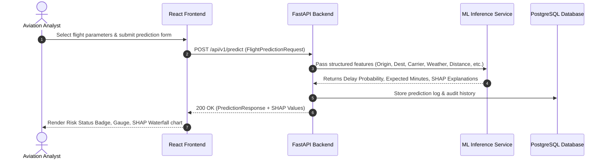

# FlightSense AI — System Architecture

This document provides a comprehensive overview of the **FlightSense AI** architecture, data flow, component design, and technology decisions.

---

## 🏗️ High-Level System Architecture

```
                                    +------------------------------+
                                    |     React + TypeScript UI    |
                                    |   (Vite + Tailwind CSS)      |
                                    +--------------+---------------+
                                                   |
                                                   | HTTP / REST API
                                                   v
                                    +------------------------------+
                                    |       FastAPI Backend        |
                                    |       (Python 3.11+)         |
                                    +-------+--------------+-------+
                                            |              |
                    +-----------------------+              +-----------------------+
                    |                                                              |
                    v                                                              v
+----------------------------------------+                      +----------------------------------+
|          PostgreSQL Database           |                      |     Machine Learning Service     |
| (Flight History, Predictions, Analytics|                      | (XGBoost, Scaler, SHAP Explainer)|
+----------------------------------------+                      +----------------------------------+
```

---

## 🧩 Architectural Principles

1. **Decoupled Monorepo Structure**: Frontend, Backend, ML pipelines, and data storage are strictly isolated in individual folders while sharing root configuration templates and documentation.
2. **Production-Ready Stubs & Interfaces**: All FastAPI endpoints enforce Pydantic data contracts (schemas). Where live database/ML artifacts are absent, deterministic and explicitly tagged development endpoints (`[MOCK DATA - DEV MODE]`) are served.
3. **Pluggable ML Pipeline**: The prediction and explainability endpoints consume a standardized `MLService` interface. When `.joblib` model binaries are placed in `/models`, the service automatically transitions from stubbed fallback logic to real inference and SHAP calculation without breaking API signatures.
4. **Resilient Frontend UI**: The React client features live health-checks, automated retry strategies, unified loading skeletons, error fallback state handlers, and robust typing via TypeScript.

---

## 🔄 End-to-End Data Flow



---

## 📦 Directory Responsibilities

| Directory | Core Responsibility | Key Technologies |
| :--- | :--- | :--- |
| `/frontend` | User interface, visualization dashboard, interactive forms, client state. | React 18, Vite, TypeScript, Tailwind CSS, Recharts, Lucide Icons |
| `/backend` | REST API routes, validation schemas, CORS, service interfaces, database ORM. | Python, FastAPI, Pydantic v2, SQLAlchemy, Uvicorn |
| `/ml` | Model training pipelines, feature engineering, evaluation, SHAP explainability generation. | Pandas, NumPy, Scikit-learn, XGBoost, SHAP, Joblib |
| `/data` | Raw & processed datasets, schema definitions, sample CSVs for unit testing. | CSV, Parquet, SQLite |
| `/models` | Serialized model artifacts, feature transformers, target encoders, and SHAP explainers. | Joblib (.joblib) |
| `/docs` | Architectural documentation, API specifications, DB schemas, training workflows. | Markdown |
